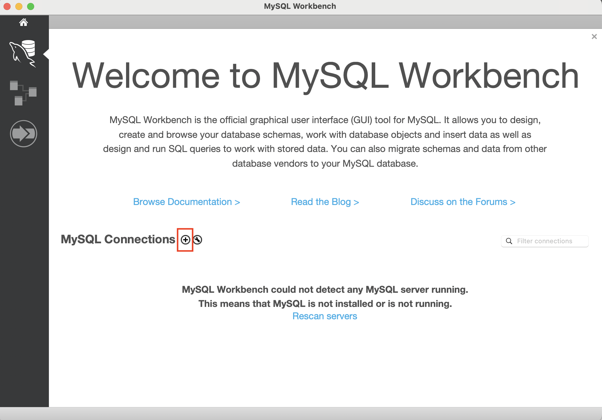
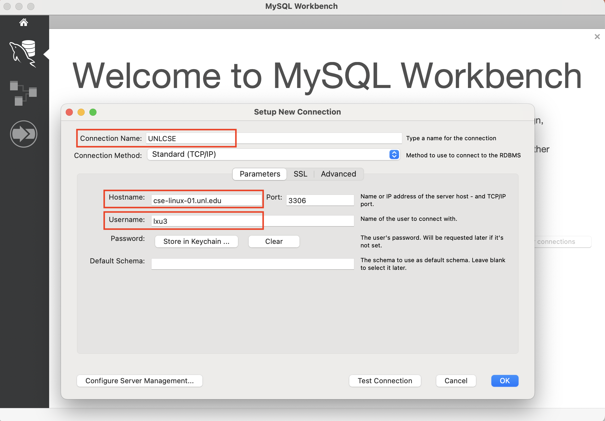
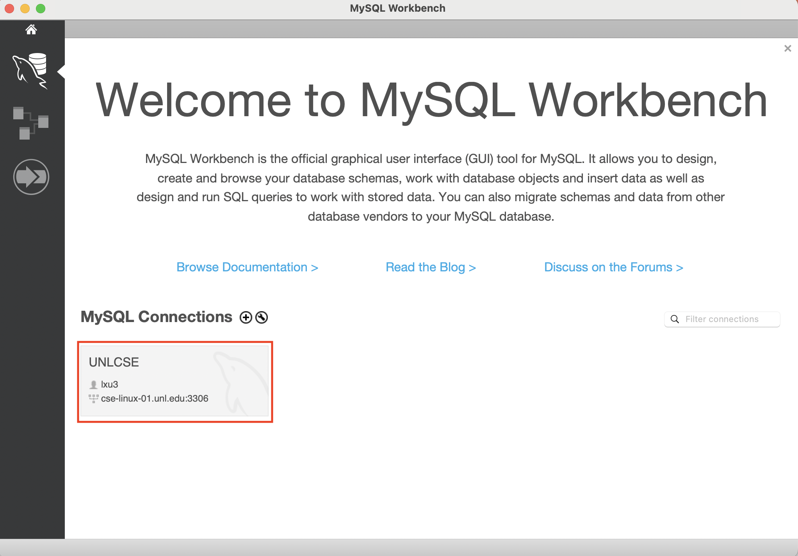
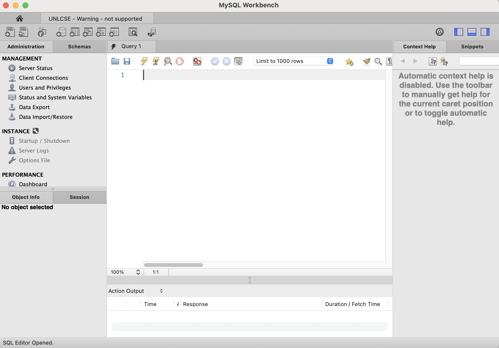

# Computer Science II
## Lab 6.0 - MySQL

An introduction to Structured Query Language (SQL) used in databases.

This is a lab used in Computer Science II (CSCE 156) for Fall 2023 
in the [School of Computing](https://computing.unl.edu) 
at the [University of Nebraska-Lincoln](https://unl.edu).

## Overview

### Resources

-   Install MySQL Workbench on your laptop:  
    <https://www.mysql.com/products/workbench/>
    
-   MySQL statements:

    -   Information About Databases and Tables  
        <http://dev.mysql.com/doc/refman/5.6/en/getting-information.html>

    -   Retrieving data  
        <http://www.w3schools.com/sql/sql_select.asp>

    -   Conditional clause  
        <http://www.w3schools.com/sql/sql_where.asp>

    -   Inserting data  
        <http://www.w3schools.com/sql/sql_insert.asp>

    -   Deleting data  
        <http://www.w3schools.com/sql/sql_delete.asp>

### Lab Objectives & Topics

Following the lab, you should be able to:

-   Connect to a database and execute queriess

-   Perform basic Create, retrieve, update, and delete (CRUD) operations

Note that the lab may involve some concepts or statements not covered (yet) in the class. You should be able to complete the lab without fully understanding them. If you have any questions about them, please feel free to ask our LAs. 


### Peer Programming Pair-Up

At the start of
each lab, you may find a team member by yourself or may be randomly paired up with another student by
a lab instructor.  One of you will be designated the *driver* 
and the other the *navigator*. If you prefer to work on this lab by yourself, that is fine too.  Each week you should try to alternate: if you were a driver 
last week, be a navigator next, etc. 

***Note that, each student must answer the lab questions on Canvas for grading.***

## 1. Install MySQL Workbench

MySQL is a free Integrated Development Environment (IDE) for 
JMySQL.  You can download and install
MySQL Workbench at the following URL.

https://www.mysql.com/products/workbench/
    

## 2. Connect to MySQL server on Linux server

We will use the MySQL server running on a Linux server of School of Computing.

1. Create a new MySQL connection by clicking the plus sign 
<p align="center">

</p>  

2. Type the hostname `cse-linux-01.unl.edu`, your MySQL username (e.g., my MySQL username is lxu3), a connection name (e.g., UNLCSE). We will use the defalt port number 3306. 
<p align="center">

</p>  

3. Open the MySQL connection 
<p align="center">

</p>  

4. Type your MySQL password, and select "Continue Anyway" if there is a "Connection Warning". Then you will be connected to the MySQL server. 
<p align="center">

</p>  

## 3. Activities 

### 3.1 Select your database

### 3.2 Create a new table

### 3.3 Insert data to the table

### 3.4 Query the table

```sql
select * from table;
```

## 4. Answer the lab questions on Canvas

* You do not need to submit any code. Instead please answer the lab questions on Canvas. 
